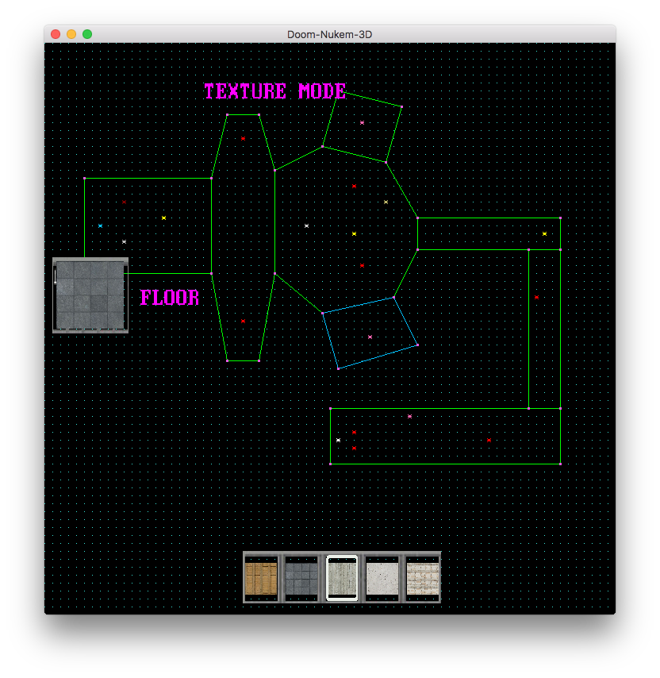

# Doom-nukem

Here is my final group project of 42 school named Doom-nukem.
We wanted to recreate the video game Duke-nukem from 1996.


## Installing

To install the game follow those commands

```
git clone https://github.com/ochaar/Doom-nukem.git
cd Doom-nukem
make
```
After you 'make', it will automaticaly download SDL for 1:30 min
and compile the project.

## Running the test

### Launch the game

When the compilation is finished just do

```
./doom-nukem
```
to run the game.

### Menu

When the game is launch you need to press enter, you'll arrive on a menu where you
con choose different options with arrows.
You can
* Start a game
* Choose maps
* Change settings
* Launch editor
* Quit game
Press esc to return on the menu and again to quit game.

### Controls in game

The goal of the game is to save your dog Rex.

Use W;A;S;D to move your player, Shift to run, mouse or Q;E to turn, Z to crawl
and X to crounch.

Press f to take weapons on the ground and to press a button in game (like elevator or door)
With 1,2 or 3 you can switch weapon.

Left clic to shoot and right clic to aim.

Press TAB one time to show the map.

You can switch map by returning on the menu with esc and select "maps".

## How to use editor

Here's an exemple of the editor


You can draw segments with your mouse by clicking on points, to create a sector (room) just
clic on your on your first point.

If you want to create a second adjacent sector you need to draw a segment on an other segment already existing.

You can change mode with the mouse wheel
* Drawing mode to draw sectors
* Moving mode to move your points and your sprites
* Placing mode to place player, weapons or ennemis
* Delete mode
* Texture mode to change textures of your sectors
On placing mode press left clic to place sprites and right clic to change sprites

On texture mode select a point and press arrows to change textures and apply on wall ceiling or floor

When you finish press F5 to save your map, you can choose it on the menu. Be careful the program can put a error message on the terminal if you want to save a wrong map, keep an eye on it.

# Hope you enjoy the game !
